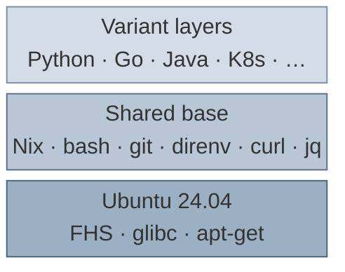

# nix-aerie

Pre-baked devcontainer image for [GitHub Codespaces](https://github.com/features/codespaces) and [local devcontainers](https://containers.dev/). Ships [Nix](https://nixos.org/), [direnv](https://direnv.net/), and pre-cached development shells on an [Ubuntu 24.04](https://ubuntu.com/) base.

## Why

Setting up Nix in a fresh container (installing the binary, evaluating a project flake, downloading packages) can take up to 3 minutes and is error-prone. Installing Nix on top of a stock image via features or scripts doesn't help: it repeats the same setup on every container start.

**nix-aerie** ships language toolchains pre-built inside the image, so `nix develop` works instantly instead of downloading packages on every start:
- **One-click onboarding** — set the image in your `devcontainer.json` and every team member gets the same Nix + direnv environment with all dev dependencies. No install steps, no entrypoint scripts.
- **Beginner-friendly** — new developers get the benefits of Nix shells without having to set up Nix themselves. Open the Codespace, start coding.
- **Instant locally** — if the image is already pulled, local devcontainers start in seconds with no download at all. On Codespaces, you can enable [prebuilds](https://docs.github.com/en/codespaces/prebuilding-your-codespaces) for the same effect.

> If you already develop locally with Nix flakes, this image isn't meant to replace that workflow. It's for Codespaces and shared devcontainers where cold start time and consistent onboarding matter.

## Usage

Simply add a `.devcontainer/devcontainer.json` to your project. Pick the variant that matches your stack (`:base`, `:python`, or the full image with all shells) and point `remoteUser` to `dev`. If your project uses direnv, `onCreateCommand` takes care of trusting the `.envrc` on first start.

Here's a real-world example for a Python project:

`.devcontainer/devcontainer.json`:

```jsonc
{
  "name": "Pre-baked devcontainer including Nix flakes, Python, uv, and direnv",
  "image": "ghcr.io/eth-library/nix-aerie-python:latest",
  "remoteUser": "dev",
  "onCreateCommand": "direnv allow .",
  "customizations": {
    "vscode": {
      "extensions": [
        "jnoortheen.nix-ide",
        "ms-python.python"
      ],
      "settings": {
        "python.defaultInterpreterPath": "${workspaceFolder}/.venv/bin/python",
        "python.terminal.activateEnvironment": false
      }
    }
  }
}
```

### Aligning your nixpkgs pin

To get the most out of the pre-cached shells, have your project's `flake.nix` follow the same nixpkgs pin as **nix-aerie**. This way `nix develop` finds everything in the Nix store and resolves instantly:

`flake.nix`:

```nix
{
  inputs = {
    nix-aerie.url = "github:eth-library/nix-aerie";
    nixpkgs.follows = "nix-aerie/nixpkgs";
  };

  outputs = { self, nixpkgs, ... }:
    let
      systems = [ "x86_64-linux" "aarch64-linux" "x86_64-darwin" "aarch64-darwin" ];
      forAllSystems = f: nixpkgs.lib.genAttrs systems (system: f nixpkgs.legacyPackages.${system});
    in
    {
      devShells = forAllSystems (pkgs: {
        default = pkgs.mkShell {
          packages = [
            pkgs.python312
            pkgs.uv
          ];
        };
      });
    };
}
```

The key line is `nixpkgs.follows = "nix-aerie/nixpkgs"`. This ensures your project uses the exact same nixpkgs revision that the image was built with, so all store paths match. Without it, `nix develop` still works but downloads packages from cache.nixos.org instead of using the pre-cached ones.

## How It Works

### Ubuntu base

The image builds on Ubuntu 24.04 for the conventional FHS layout, glibc, and `apt-get`, the things devcontainer features and standard Linux tooling expect. A familiar starting point for developers new to Nix: no need to learn NixOS to benefit from reproducible toolchains.

### Nix-managed toolchain

All developer tools (bash, git, direnv, curl, jq, and language shells) are managed by Nix through a single `flake.nix` with one `flake.lock`. Reproducible, pinned, and pre-cached in the image.

The image also ships with [direnv](https://direnv.net/) and [nix-direnv](https://github.com/nix-community/nix-direnv) pre-configured. When your project has an `.envrc` with `use flake`, opening a terminal automatically activates the Nix shell. No manual `nix develop` needed.

### Variants and layer architecture

Each Nix shell closure (Python, Go, Java, K8s) is mapped to its own content-addressed OCI layer via [nix2container](https://github.com/nlewo/nix2container). The shared base packages are built as a separate layer and excluded from shell layers to avoid duplication. Variants compose only the layers they need:



| Variant | Image | Packages | Shell definition |
|---------|-------|----------|-----------------|
| Base | `nix-aerie-base` | Nix, bash, git, direnv, curl, jq | [`flake.nix` (`userPackages`)](flake.nix#L62) |
| Python | `nix-aerie-python` | Python 3.12, uv | [`shells/python.nix`](shells/python.nix) |
| Go | `nix-aerie-go` | Go, gopls, golangci-lint | [`shells/go.nix`](shells/go.nix) |
| Java | `nix-aerie-java` | JDK 25 (headless), Maven | [`shells/java.nix`](shells/java.nix) |
| K8s | `nix-aerie-k8s` | kubectl, Helm | [`shells/k8s.nix`](shells/k8s.nix) |
| Full | `nix-aerie` | All of the above | all shells combined |

Because layers are content-addressed, pulling one variant after another only downloads the delta. Security updates push only the store paths that actually changed, not the full image.

The nixpkgs source tree (~32 MB compressed) is also included in the Nix store, so flake evaluation doesn't need to download nixpkgs first. This saves time on every `nix develop` call regardless of whether your pins match the image.

## Details

- **nix2container** builds the image without Docker. Content-addressed layers mean updates push only the store paths that changed, not the full image.
- **Single-user Nix**, the container standard; no daemon or systemd required.
- **`USER=dev`** in the image, ready for devcontainers and `docker run` out of the box.
- **One `flake.lock`** pins all shells to the same nixpkgs revision, guaranteeing store-path deduplication across variants.
- **Architecture**: `linux/amd64` for Codespaces; `linux/arm64` available in `flake.nix` for local testing on Apple Silicon.

## License

[Apache-2.0](LICENSE)
